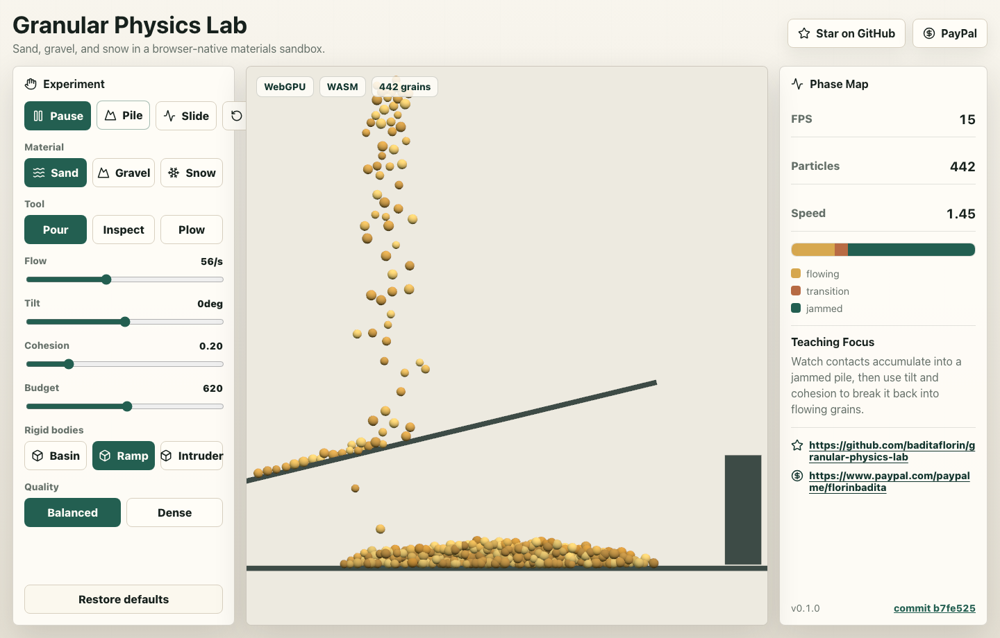
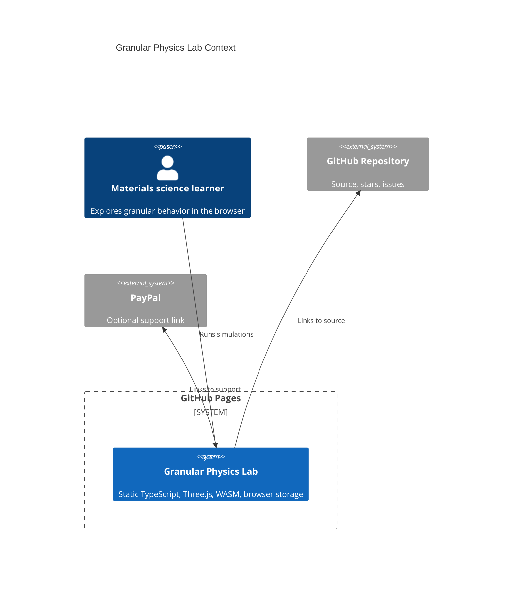

# Granular Physics Lab

Live site: https://baditaflorin.github.io/granular-physics-lab/

Repository: https://github.com/baditaflorin/granular-physics-lab

Granular Physics Lab is a static browser sandbox for teaching how sand, gravel, and snow shift between flowing, piling, and jammed behavior.



## Quickstart

```bash
npm install
make install-hooks
make dev
make build
make smoke
```

## What It Builds

- A Mode A GitHub Pages app with no runtime backend.
- A Three.js scene that prefers WebGPU and falls back to WebGL.
- A lazy-loaded WASM material kernel for contact impulse and phase-state calculations.
- Local browser persistence for lab controls and presets.

## Architecture



Docs:

- Architecture: docs/architecture.md
- ADRs: docs/adr/
- Deployment: docs/deploy.md
- Privacy: docs/privacy.md
- Postmortem: docs/postmortem.md

## Git Hooks

Local hooks are kept in `.githooks/`.

```bash
make install-hooks
```

No GitHub Actions are used. Checks run locally through `make lint`, `make test`, `make build`, and `make smoke`.
