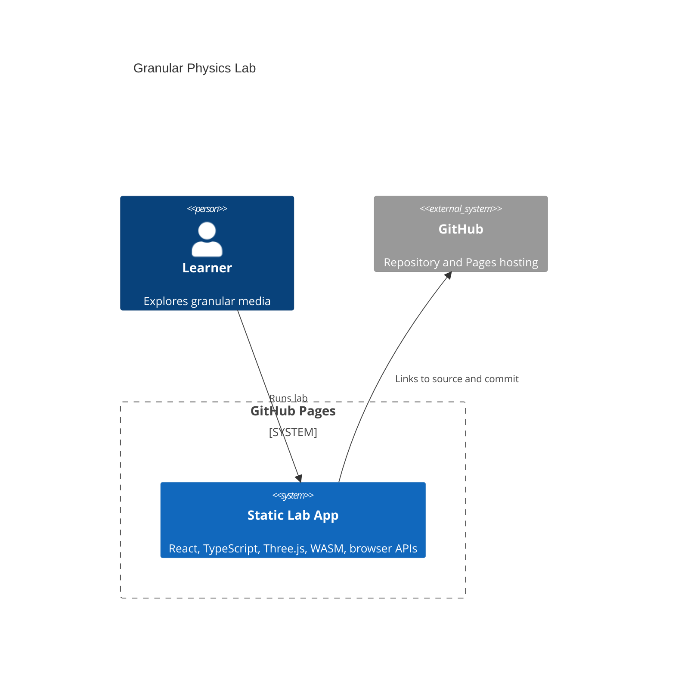
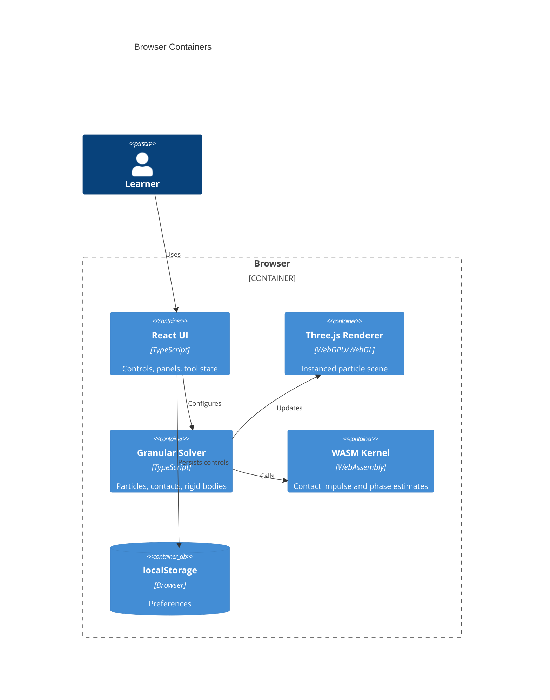

# Architecture

## Context

```mermaid
C4Context
  title Granular Physics Lab
  Person(user, "Learner", "Explores granular media")
  System_Boundary(pages, "GitHub Pages") {
    System(app, "Static Lab App", "React, TypeScript, Three.js, WASM, browser APIs")
  }
  System_Ext(github, "GitHub", "Repository and Pages hosting")
  Rel(user, app, "Runs lab")
  Rel(app, github, "Links to source and commit")
```

## Container

```mermaid
C4Container
  title Browser Containers
  Person(user, "Learner")
  Container_Boundary(browser, "Browser") {
    Container(ui, "React UI", "TypeScript", "Controls, panels, tool state")
    Container(renderer, "Three.js Renderer", "WebGPU/WebGL", "Instanced particle scene")
    Container(physics, "Granular Solver", "TypeScript", "Particles, contacts, rigid bodies")
    Container(wasm, "WASM Kernel", "WebAssembly", "Contact impulse and phase estimates")
    ContainerDb(storage, "localStorage", "Browser", "Preferences")
  }
  Rel(user, ui, "Uses")
  Rel(ui, physics, "Configures")
  Rel(physics, wasm, "Calls")
  Rel(physics, renderer, "Updates")
  Rel(ui, storage, "Persists controls")
```

## Boundaries

GitHub Pages serves static files only. The browser owns rendering, simulation, storage, and all interaction state.

